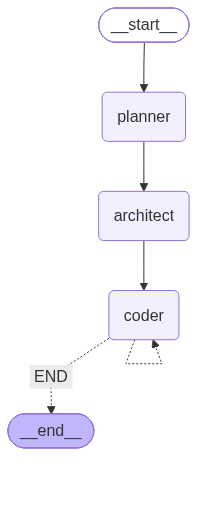

# CodeBuddy 🚀

**CodeBuddy** is an autonomous AI-powered software engineer built with [LangGraph](https://github.com/langchain-ai/langgraph), [FastAPI](https://fastapi.tiangolo.com/), and a modern [Next.js](https://nextjs.org/) web interface styled with [Tailwind CSS](https://tailwindcss.com/) and [shadcn/ui](https://ui.shadcn.com/).

It functions as a multi-agent development team that converts natural language requests into complete, working software projects — file by file — using real engineering workflows.

---

## 🏗️ Architecture

- **Planner Agent** – Analyzes user prompts, establishes the technology stack, system specifications, and plans the target file tree architecture.
- **Architect Agent** – Decomposes the plan into sequential, dependency-ordered engineering tasks with explicit context carryover.
- **Coder Agent** – Tool-using agent that executes tasks, inspects the workspace, writes complete source files, and iteratively implements the full project.

<div align="center">
    
</div>

---

## 🌟 Web Interface Highlights

- **Visual Multi-Agent Pipeline**: Real-time status cards tracking Planner ➔ Architect ➔ Coder with glowing progress indicators.
- **Real-Time SSE Streaming**: Live event stream delivering agent thoughts, file creation notices, and implementation steps.
- **Plan & Tasks Inspector**: Interactive tabs for app blueprints, feature checklists, and architect task breakdowns.
- **Project Explorer & Code Viewer**: Tree browser of `generated_project` files with file-type icons, line numbers, and copy-to-clipboard.
- **One-Click ZIP Export**: Download your generated application directly from the web browser.
- **Clean Workspace Reset**: Wipe and start fresh projects directly from the UI.

---

### ⚡ Quick Start (One Command)
Run both the FastAPI backend and Next.js frontend together with:
```bash
python run.py
```
This automatically starts:
- 🌐 Next.js Web App: **http://localhost:3000** (opens in your default browser)
- ⚡ FastAPI Backend: **http://127.0.0.1:8000**
- 📚 Interactive API Docs: **http://127.0.0.1:8000/docs**

---

### 🛠️ Manual / Step-by-Step Setup
- **Python 3.10+** and [uv](https://docs.astral.sh/uv/getting-started/installation/)
- **Node.js 18+** and npm
- **Groq API Key**: Create an API key at [console.groq.com/keys](https://console.groq.com/keys).

### 2. Backend Setup (FastAPI & LangGraph)

1. Create a virtual environment and activate it:
   ```bash
   uv venv
   # On Windows:
   .venv\Scripts\activate
   # On macOS/Linux:
   source .venv/bin/activate
   ```

2. Install dependencies:
   ```bash
   uv pip install -r requirements.txt
   ```

3. Configure your API key in `.env`:
   ```env
   GROQ_API_KEY=your_groq_api_key_here
   ```

4. Start the FastAPI backend server:
   ```bash
   uvicorn api.main:app --reload --port 8000
   ```
   > FastAPI docs will be available at [http://127.0.0.1:8000/docs](http://127.0.0.1:8000/docs).

### 3. Frontend Setup (Next.js + shadcn + Tailwind CSS)

1. Navigate to the `frontend` folder:
   ```bash
   cd frontend
   ```

2. Install dependencies:
   ```bash
   npm install
   ```

3. Start the Next.js development server:
   ```bash
   npm run dev
   ```

4. Open [http://localhost:3000](http://localhost:3000) in your browser.

---

## 📡 API Endpoints

| Endpoint | Method | Description |
| :--- | :---: | :--- |
| `/api/health` | `GET` | Health check & Groq configuration status |
| `/api/generate/stream` | `POST` | Real-time Server-Sent Events (SSE) stream for agent workflow |
| `/api/generate` | `POST` | Synchronous project generation fallback |
| `/api/project/files` | `GET` | Lists all generated files in workspace |
| `/api/project/file?path=...` | `GET` | Fetches code content of a generated file |
| `/api/project/download` | `GET` | Downloads the generated project as a `.zip` archive |
| `/api/project/reset` | `POST` | Clears the `generated_project` workspace folder |

---

## 🧪 Example Prompts

- *Create a modern, responsive Todo list application using HTML, CSS, and vanilla JavaScript with dark mode and localStorage persistence.*
- *Create a simple blog API in FastAPI with a SQLite database, CRUD endpoints for posts, and Pydantic schemas.*
- *Create an interactive calculator web application with calculation history and keyboard shortcuts.*
- *Build a markdown note-taking app in HTML, CSS, and JS with side-by-side preview and text export.*
